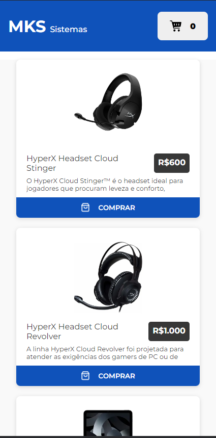

# 🎯 Objetivo

Desenvolver uma aplicação com Next capaz de exibir a lista de produtos da loja ,
utilizando Redux para gerenciamento de estados, Styled Components para
estilização e Jest para testes unitários.

<br>

# 🖵 Layout

|                    🖥️ Desktop                    |                    📱 Mobile                    |
| :----------------------------------------------: | :---------------------------------------------: |
|  | ) |

# ⚙️ Tecnologias

[React JS](https://pt-br.reactjs.org/) - Biblioteca JavaScript criada para construir telas de forma declarativa.

[Next JS](https://nextjs.org/") - Um framework para React capaz de adicionar
várias funcionalidades em cima do React.

[TypeScript](https://www.typescriptlang.org/) - Um superconjunto de JavaScript, ou seja, um conjunto de ferramentas e formas mais eficientes de escrever código JavaScript.

[Jest](https://jestjs.io/pt-BR/) - Um poderoso framework de testes unitários em JavaScript com foco na simplicidade.

[Styled Components](https://styled-components.com/docs) - uma biblioteca React
que permite criar componentes de estilo ao escrever códigos CSS dentro de um arquivo Typescript.

 <br>

# 🏁 Iniciando o Projeto

1 - Clone o Projeto e entre na pasta respectiva

```bash
git clone https://github.com/victorhenriqu3/mks-frontend-challenge
cd mks-frontend-challenge
```

2 - Instale as dependências

```bash
yarn add

## ou se preferir pode utilizar npm, vai da sua escolha

npm install
```

3 - Inicialize o Projeto

```bash
yarn dev
```

4 - 📦 Extra: Para realizar os testes Unitários

```bash
yarn test
```

<br>

# 🔨 Funcionalidades do projeto

- `Loja`:
  - [x] `A lista de produtos deve ser buscada da API disponibilizada`
  - [x] `adicionar shimmer/skeleton enquanto estiver em loading`

<br>
  
  * `Carrinho`: 
    - [x] `O carrinho deve conter todos os produtos selecionados`
    - [x] `adicionar a opção de aumentar a quantidade de cada produto selecionado`

<br>

- `Testes`:
  - [x] testar adicionar item ao carrinho com `addToCart`.
  - [x] testar remover item do carrinho com `removeFromCart`.
  - [x] testar diminuir quantidade do item no carrinho com `decreaseCart`.
  - [x] testar `subTotals` no carrinho.
  - [x] testar quantidade de items indicados no Header.

# ✍️ Autor

<div  align="center">

<a href="https://github.com/victorhenriqu3">
 
 <br />
 <sub><b style="font-size: 15px;">Victor Henrique 🚀</b></sub></a>

👋🏽 Entre em contato!

[](https://www.linkedin.com/in/victorhenriqu3/)
[](mailto:victorhenriqu3@outlook.com)
[](https://github.com/victorhenriqu3)

</div>

---

&copy; 2023 Feito com ❤️ por [Victor Henrique](https://github.com/victorhenriqu3).
